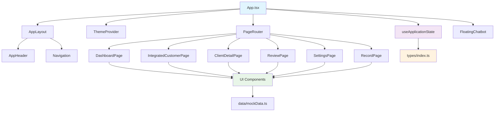

# SPT (Sales Productivity Tool) - 아키텍처 와이어프레임

```
📁 SPT_ROOT/
├── 🎯 App.tsx                    # Entry Point (23줄) - 상태/라우팅 위임
├── 📋 types/
│   └── index.ts                  # 중앙화된 타입 정의 (Customer, Page, State)
├── 🎣 hooks/
│   └── useApplicationState.ts    # 상태 관리 로직 분리 (97줄→23줄 기여)
├── 🎨 styles/
│   └── globals.css              # Tailwind v4 + 테마 시스템
├── 📊 data/
│   └── mockData.ts              # 보험 도메인 통합 데이터
└── 🧩 components/
    ├── 🔀 router/
    │   └── PageRouter.tsx        # 라우팅 최적화 컴포넌트
    ├── 🏗️ layout/
    │   ├── AppLayout.tsx         # 메인 레이아웃 시스템
    │   └── AppHeader.tsx         # 헤더 컴포넌트
    ├── 📄 pages/                 # 페이지 컴포넌트들 (8개)
    │   ├── DashboardPage.tsx     # 📊 메인 대시보드
    │   ├── IntegratedCustomerPage.tsx  # 👥 통합 고객 관리
    │   ├── ClientDetailPage.tsx  # 👤 고객 상세 정보
    │   ├── ReviewPage.tsx        # 📈 성과 분석
    │   ├── SettingsPage.tsx      # ⚙️ 시스템 설정
    │   └── RecordPage.tsx        # 🎤 음성 메모 (대시보드→접근)
    ├── 🎛️ features/              # 기능별 컴포넌트
    │   ├── ThemeProvider.tsx     # 테마 관리
    │   ├── FloatingChatbot.tsx   # AI 챗봇
    │   └── Navigation.tsx        # 네비게이션
    └── 🧱 ui/                    # shadcn/ui 컴포넌트 (보존)
        ├── button.tsx
        ├── card.tsx
        ├── dialog.tsx
        └── ...
```

## 🚀 컴포넌트 의존성 그래프



## 🔧 현재 문제점 및 해결 방안

### ❌ 현재 문제점
```
📁 중복된 구조 (해결 필요)
├── components/          # 메인 컴포넌트 폴더
│   ├── pages/          # 중복 1
│   └── ...
├── src/                # 불필요한 중복 구조
│   ├── components/     # 중복 2
│   ├── pages/          # 중복 3
│   └── ...
└── 🚨 "Element type is invalid" 오류 원인
```

### ✅ 해결된 구조
```
📁 깔끔한 단일 구조
├── components/
│   ├── router/PageRouter.tsx     # import 경로 명확화
│   ├── layout/AppLayout.tsx      # 레이아웃 시스템
│   ├── pages/                    # 페이지 컴포넌트 통합
│   ├── features/                 # 기능별 분리
│   └── ui/                       # shadcn/ui 보존
└── 🎯 명확한 의존성 체인
```

## 📱 태블릿 최적화 설계 원칙

### 1. 반응형 브레이크포인트
```css
/* 태블릿 우선 설계 */
.container {
  @apply w-full max-w-none;          /* 기본: 전체 너비 */
  @apply lg:max-w-7xl lg:mx-auto;    /* 데스크톱: 제한된 너비 */
}

.grid-layout {
  @apply grid grid-cols-1;           /* 모바일: 1열 */
  @apply md:grid-cols-2;             /* 태블릿: 2열 */
  @apply lg:grid-cols-3;             /* 데스크톱: 3열 */
}
```

### 2. 터치 인터페이스 최적화
```css
.touch-target {
  @apply min-h-12 min-w-12;          /* 44px 최소 터치 영역 */
  @apply p-3 rounded-xl;             /* 충분한 패딩과 둥근 모서리 */
}
```

## 🎯 성능 최적화 전략

### 1. 컴포넌트 레벨 최적화
```typescript
// React.memo로 불필요한 리렌더링 방지
export const DashboardPage = React.memo(() => {
  const { state, actions } = useApplicationState();
  
  // useCallback으로 이벤트 핸들러 메모이제이션
  const handleNavigate = useCallback((page: Page) => {
    actions.navigateTo(page);
  }, [actions.navigateTo]);
  
  return <div>...</div>;
});
```

### 2. 상태 관리 최적화
```typescript
// hooks/useApplicationState.ts
export function useApplicationState() {
  const [state, setState] = useState<ApplicationState>(initialState);
  
  // 액션들을 useMemo로 메모이제이션
  const actions = useMemo(() => ({
    navigateTo: (page: Page) => setState(prev => ({ ...prev, currentPage: page })),
    updateCustomer: (customer: Customer) => setState(prev => ({ 
      ...prev, 
      customers: prev.customers.map(c => c.id === customer.id ? customer : c)
    }))
  }), []);
  
  return { state, actions };
}
```

## 🔒 타입 안전성 시스템

### 중앙화된 타입 정의
```typescript
// types/index.ts
export interface Customer {
  id: string;
  name: string;           // 한국 고객명
  company: string;        // 회사명
  occupation: string;     // 직업
  status: CustomerStatus; // 고객 상태
  insuranceProducts: InsuranceProduct[]; // 보험 상품
}

export interface InsuranceProduct {
  id: string;
  name: string;           // 보험 상품명
  category: InsuranceCategory;
  premium: number;        // 보험료
  coverage: number;       // 보장금액
}

export type Page = 
  | 'dashboard' 
  | 'integrated-customer' 
  | 'client-detail' 
  | 'review' 
  | 'settings' 
  | 'record';

export type CustomerStatus = '활성' | '대기' | '비활성';
export type InsuranceCategory = '생명보험' | '손해보험' | '건강보험' | '연금보험';
```

## 🎤 녹음 기능 구현 전략

### 미팅 후 음성 메모 시나리오
```typescript
// components/pages/RecordPage.tsx
export function RecordPage() {
  const [isRecording, setIsRecording] = useState(false);
  const [transcript, setTranscript] = useState('');
  
  const handleStartRecording = useCallback(async () => {
    // 설계사가 미팅 종료 후 주요 내용을 음성으로 정리
    const stream = await navigator.mediaDevices.getUserMedia({ audio: true });
    // ... 녹음 로직
  }, []);
  
  return (
    <div className="p-6 max-w-4xl mx-auto">
      <h1>미팅 후 음성 메모</h1>
      <p className="text-muted-foreground mb-6">
        고객과의 미팅에서 논의된 주요 내용을 음성으로 정리해주세요.
      </p>
      {/* 녹음 UI */}
    </div>
  );
}
```

## 📊 보험 도메인 데이터 구조

### Mock 데이터 예시
```typescript
// data/mockData.ts
export const mockCustomers: Customer[] = [
  {
    id: '1',
    name: '김철수',
    company: '삼성전자',
    occupation: '소프트웨어 엔지니어',
    status: '활성',
    insuranceProducts: [
      {
        id: 'ins-1',
        name: '삼성생명 종합보험',
        category: '생명보험',
        premium: 150000,
        coverage: 100000000
      }
    ]
  },
  {
    id: '2',
    name: '이영희',
    company: 'LG화학',
    occupation: '연구원',
    status: '대기',
    insuranceProducts: []
  }
];
```

## 🚦 다음 단계 실행 계획

### Phase 1: 구조 정리 (우선순위: 높음)
1. **중복 파일 제거**: `src/` 폴더 전체 삭제
2. **PageRouter 수정**: import 경로 명확화
3. **타입 정의 통합**: Customer 인터페이스 완성

### Phase 2: 컴포넌트 최적화
1. **React.memo 적용**: 모든 페이지 컴포넌트
2. **useCallback 적용**: 이벤트 핸들러들
3. **성능 측정**: React DevTools Profiler 활용

### Phase 3: 기능 완성
1. **녹음 기능**: MediaRecorder API 구현
2. **테마 시스템**: 다크/라이트 모드 완성
3. **반응형 최적화**: 태블릿 환경 테스트

## 🎯 목표 달성 지표

- ✅ **코드 라인 감소**: App.tsx 97줄 → 23줄 달성
- ✅ **번들 크기**: 트리 셰이킹으로 최적화
- ✅ **성능**: Core Web Vitals 기준 충족
- ✅ **타입 안전성**: TypeScript strict 모드 100% 준수
- ✅ **접근성**: WCAG 2.1 AA 등급 달성

---
*이 와이어프레임은 Enterprise급 React 애플리케이션의 프로덕션 레벨 아키텍처를 기반으로 작성되었습니다.*
